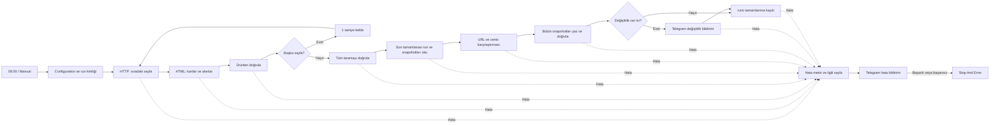

# Bölüm B — Günlük laptop fiyat takibi

Teslim: [workflow.json](workflow.json). Google Sheets üzerinde tarihli snapshot, Telegram üzerinde yeni ürün/fiyat değişikliği bildirimi tasarımıdır. Akış **pasiftir (`active: false`)**. JSON ve çevrimdışı davranış kontrolleri yapıldı; **gerçek n8n importu, runtime çalıştırması, Sheets yazımı veya Telegram gönderimi yapılmadı**. Case bu canlı işlemleri zorunlu tutmuyor.

## Başlangıç şablonu ve uyarlama

- **Competitor price monitoring with web scraping,Google Sheets & Telegram** — **Tony Paul**.
- [n8n şablon sayfası](https://n8n.io/workflows/4640-competitor-price-monitoring-with-web-scrapinggoogle-sheets-and-telegram/).
- [Özgün JSON API kaynağı](https://api.n8n.io/api/templates/workflows/4640). Sayfa ve JSON 25.09.2026 tarihinde gerçekten indirildi/incelendi. API yanıtındaki `workflow.workflow` nesnesi incelendi; n8n'e import edilmedi.
- İndirilen API yanıtının SHA-256 değeri: `04CC2A27A5BCA9565B3FF8B50B2A625A2526E396304218AEFFBE6236AB54A382`.

Özgün JSON, gerçek spreadsheet/chat/credential referansları içerdiğinden teslim deposuna kopyalanmadı. Yeni workflow'un node ID'leri yeniden üretildi; tüm credential alanları çıkarıldı, iki kullanıcı ayarı placeholder olarak bırakıldı. Aşağıdaki uyarlama özgün düğümler ve akış mantığı incelenerek yapıldı:

| Şablondaki yapı | Bu teslimdeki karşılığı/değişiklik |
| --- | --- |
| Daily 8AM Trigger | `Daily 09 Istanbul`: her gün 09.00, workflow saat dilimi Europe/Istanbul; ayrıca Manual Start |
| Fetch Product List from Sheet | Sabit ürün listesi kaldırıldı; kaynak kategoriden sayfalar ve ürün URL'leri keşfediliyor |
| Tek ürünlük batch, Pause Between Requests, Load Product Page HTML | Sayfa başına HTTP Request; `More Pages → Page Delay → Page State` kontrollü döngüsü |
| Extract Current Price from HTML | Kategori HTML'inden önce ayrı kartlar, sonra her karttan title/fiyat/yorum/link; şablonun farklı siteye ait fiyat selector'ı değiştirildi |
| Normalize Price Values / Compute Price Change / IF | Sıkı doğrulama, URL üzerinden önceki tamamlanmış snapshot ile cents karşılaştırması; yeni ürünler ayrıca belirleniyor |
| Log Price History / Update Last Price in Master Sheet | `snapshots` ve `runs` tabloları; bütün snapshot yazımından ve bildirimden sonra tamamlanma kaydı |
| Build Telegram Alert / Send Price Alert | HTML kaçışlama, boyut sınırında açık özet + tablo bağlantısı; şablondaki Markdown ve elle Hindistan saat farkı kaldırıldı |
| Sticky notes | Kısa kurulum notu ve ayrıntılı bu belge; bağlı hata bildirimi ve Stop And Error eklendi |

## Akış



1. **Configuration:** Spreadsheet ID, Telegram chat ID, kaynak URL, güvenlik sınırı, bekleme ve timeout tek noktada. `Initialize Run` ayarları kontrol eder; bir `run_id` ve UTC ISO `scraped_at` üretir. Kimlik n8n execution ID ve zaman damgasını içerir. Bir çalışmanın bütün ürünleri aynı kimlik/zamanı taşır. Günlük tetikleme yerel 09.00'dır; depolanan UTC damgalar saat diliminden bağımsızdır.
2. **Sayfa döngüsü:** `Page State` ilk sayfa için `?page=1` üretir. `Fetch Page` GET, 10 saniye timeout, toplam en fazla 3 deneme ve denemeler arasında 1 saniye kullanır. Başarısız HTTP durumları hata kabul edilir; yönlendirme kapalıdır. Sonraki sayfa öncesi `Page Delay` en az 1 saniye bekler. n8n'in genel retry özelliği HTTP hata türlerini ayırmadığından kalıcı 4xx için de sınırlı tekrar olabilir.
3. **Dinamik sayfalama:** `.pagination a[href]` bağlantılarından görülen en yüksek sayfaya kadar **ardışık** gidilir; örneğin 1, 2, 4 görülürse 3 atlanmaz. Her yeni sayfadaki bağlantılar hedefi genişletebilir. Yalnızca sabit kaynak kategori yolu ve tek pozitif `page` parametresi kabul edilir; başka host/yol/parametreler hata verir. Bağlantısız, ürün içeren tek sayfa geçerlidir. Varsa `.pagination .active` numarası istenen sayfayla eşleşmelidir. Varsayılan `page_limit: 200` bir güvenlik sınırıdır: **200'e ulaşılması başarısızlıktır**, 200 sayfalık başarılı tarama olarak yorumlanmaz.
4. **Kart bazında HTML çıkarımı:** `Extract Page HTML`, `.thumbnail` iç HTML parçalarını çıkarır. `Expand Cards` her karta bir item ve sayfa bağlamı verir. `Extract Card HTML` her item üzerinde aşağıdaki selector'ları çalıştırır; alanlar farklı ürünlerin paralel dizilerinden birleştirilmez. `Validate Page` kart sayısını ve item eşleşmesini de kontrol eder.

| Alan | Selector / doğrulama |
| --- | --- |
| product_name | `a.title` → `title` attribute; yok/boşsa aynı bağlantının metni; tek ve boş olmayan başlık |
| price | `.price [itemprop="price"]` metni; `$` ve geçerli binlik virgülleri temizlenir; sonlu, negatif olmayan, en fazla iki ondalıklı sayı; boş fiyat **0 yapılmaz** |
| review_count | `[itemprop="reviewCount"]` metni; sıfır dahil güvenli, negatif olmayan tam sayı |
| product_url | `a.title` → href; aynı host üzerinde `/test-sites/e-commerce/static/product/{sayısal-id}` biçiminde mutlak URL |

5. **Tarama kapısı:** Boş sayfa, eksik/çoklu zorunlu alan, geçersiz fiyat, tekrarlanan ürün URL'si veya sayfa uyuşmazlığı hata dalına gider. `Finalize Scan` 1'den keşfedilen son sayfaya kadar eksiksiz ziyaret edildiğini ve en az bir ürün olduğunu kontrol eder. **Bu kapıdan önce Sheets yazma düğümü yoktur.** Ürünler bellekte tutulur; aynı URL iki sayfada görünürse sessizce birleştirmek yerine tutarsız tarama kabul edilir.
6. **Geçmiş seçimi:** `Read Runs → Select Previous Run`, `completed_at` değeri en yeni olan tamamlanmış çalışmayı seçer. Eşit zaman varsa run_id ile kararlı seçim yapılır. `Read Snapshots → Compare Snapshots` sadece seçilen run_id satırlarını kullanır; eski çalışmalar ve tamamlanma kaydı olmayan yarım yazımlar dışlanır. Seçilen snapshot sayısı kayıtlı product_count ile uyuşmazsa hata verilir. Yinelenen URL/run_id ve bozuk geçmiş fiyatları da reddedilir.
7. **Karşılaştırma:** Ürün adı veya sıra yerine URL kullanılır. `"416.99"` ve `416.99` aynı cents değeridir. Önceki URL yoksa yeni ürün; cents değişmişse fiyat değişikliği, eski/yeni fiyat birlikte. İlk çalışmada runs boşsa tüm ürünler yenidir. Silinen ürün bildirimi bu case kapsamına eklenmedi.
8. **Kalıcı kayıt:** `Snapshot Rows` tam altı sütunu üretir. `Append Snapshots` toplu yazımı bekler; `Confirm Snapshots` dönen satır sayısı/kimliklerini kontrol eder. `RAW` yazım, ürün adının formül olarak yorumlanmasını önler. Değişiklik olmasa da bütün başarılı tarama tarih damgasıyla kaydedilir. Bu doğrulama Sheets'e ayrı bir geri-okuma veya veritabanı transaction'ı değildir.
9. **Bildirim:** `Has Changes` yalnızca değişiklik varsa `Send Changes` yoluna gider. Yeni üründe ad/fiyat/link, fiyat değişiminde eski ve yeni fiyat vardır. Dinamik metin HTML-escape edilir, Telegram `parse_mode: HTML` kullanılır. Uzun listelerde 3200 karakterlik giriş bütçesi ve 3900 karakterlik toplam üst sınır uygulanır; isimler 180 Unicode kod noktasıyla sınırlandırılır. Sığmayan değişiklik sayısı açıkça yazılır, bütün snapshotlar için Google Sheets bağlantısı ve run_id eklenir. Tek mesajlık özet seçildi; kesilerek bozuk HTML üretilmez. Tam ürün adı Sheets'te korunur.
10. **Tamamlanma:** Değişiklik bildirimi başarılı olduktan sonra veya değişiklik yoksa doğrudan `Prepare Completed Run → Append Completed Run` çalışır. Telegram cevabı run bağlamını taşımadığı için bu düğüm veriyi bir kez çalışan `Compare Snapshots` referansından alır. Döngü içindeki HTML düğümlerinin bağlamı ise `pairedItem` ve `.itemMatching(index)` üzerinden alınır.

## Google Sheets yapısı ve ilk çalışma

Tek spreadsheet içinde şu isimlerle iki sekme oluşturulur. Başlıklar birinci satırda, aşağıdaki yazımla olmalıdır:

```text
snapshots: run_id | scraped_at | product_url | product_name | price | review_count
runs:      run_id | completed_at | product_count
```

Başlangıçta **yalnızca başlıklar**, veri satırları boş olabilir. İki okuma düğümünde `alwaysOutputData: true` boş sonucu bir item ile devam ettirir. `continueRegularOutput` hataları da sonraki doğrulama düğümüne getirir; o düğüm `error` alanını / item hatasını **boş geçmiş kararından önce** kontrol edip gerçek hata dalına gönderir. Böylece Sheets yetki/ağ hatası ilk çalışma gibi değerlendirilmez. Okumada ayrı hata çıkışı ile `alwaysOutputData` birlikte kullanılmadı: kontrol edilen n8n yürütücüsünde bu birleşim hata yanında boş bir başarı item'ı da oluşturabiliyor.

Okumalar küçük case için iki sekmenin tamamını alır; en son tamamlanan run_id filtrelemesi Code içinde yapılır. Başlıkları değiştirmeyin, yinelenen veya elle bozulmuş tamamlanma kayıtları eklemeyin. Append ayarları otomatik sütun eşleştirme, RAW değer ve fazladan alanlarda hata kullanır. Append düğümlerinde otomatik retry yoktur; başarılı yazımın cevabı kaybolduğunda çift satır ekleme riskini azaltır.

## Hata davranışı ve tekrar çalıştırma

- HTTP, HTML ve doğrulama hataları `Build Error → Send Error → Fail Execution` yolundadır. Hata metninde neden ve ilgili sayfa/kaynak URL vardır. Eksik sayfa/boş ürün/geçersiz alan normal yazım koluna ulaşamaz.
- Sheets okuma hataları bitişikteki Code kontrolünden aynı hata yoluna gider. Sheets yazım ve değişiklik bildirimi hatalarının ayrı hata çıkışı da bu yola bağlıdır.
- `Send Error` düğümünün hem normal hem hata çıkışı `Stop And Error` düğümüne gider. Hata bildirimi teslim edilemese de çalışma başarısız kalır. Credential/yapılandırma hataları bildirim gönderilmesini de engelleyebilir; başarılı çalışma gibi kaydedilmez.
- Sıra **snapshot → değişiklik bildirimi → runs tamamlanma kaydı**. Bildirim başarısızsa marker yazılmaz; sonraki yeni çalışma son başarılı run ile yeniden karşılaştırır. Yarım snapshot satırları tabloda kalabilir, referans sayılmaz.
- Telegram mesajı teslim edildiği halde yanıt kaybolursa veya ardından runs yazımı başarısızsa tekrar bildirim görülebilir. Son runs yazımının cevabı kaybolduğunda kaydın sunucuda oluşup oluşmadığı belirsizdir; tablo ve execution kaydı incelenmelidir. Akış “exactly once” iddiasında değildir. Hata metni bu belirsizliği saklamaz.
- Hatalı çalışmayı ara düğümden devam ettirmek yerine baştan yeni execution olarak çalıştırın; yeni run_id oluşur. Yarım satırlar sonradan yalnızca ilgili tamamlanmamış run_id doğrulanarak temizlenebilir; akış otomatik silmez.
- **Aynı spreadsheet için bir seferde yalnızca bir execution çalıştırın.** Günlük çalışma sürerken Manual Start kullanmayın; aynı akışın kopyalarını paralel etkinleştirmeyin. Bu küçük tasarımda dağıtık kilit/kuyruk yoktur; n8n dağıtımınız destekliyorsa execution eşzamanlılık sınırını ayrıca 1 yapın.

## n8n'e kurulum

Bu adımlar kullanıcı tarafından gerçek çalıştırma istendiğinde yapılır; teslim sırasında uygulanmadı.

1. `workflow.json` dosyasını n8n arayüzündeki dosyadan import seçeneğiyle yükleyin. JSON dışındaki yerel script'lere ihtiyaç yoktur.
2. Yukarıdaki iki Sheets sekmesini ve başlıkları oluşturun.
3. `Configuration` Code düğümünde `REPLACE_WITH_SPREADSHEET_ID` ve `REPLACE_WITH_TELEGRAM_CHAT_ID` değerlerini değiştirin. Kaynak kategori URL'si bu göreve özeldir; başka siteye geçmek selector/doğrulama değişikliği gerektirir.
4. `Read Runs`, `Read Snapshots`, `Append Snapshots`, `Append Completed Run` düğümlerinde Google Sheets OAuth2 credential'ını n8n arayüzünden seçin; hesap ilgili tabloya erişebilsin.
5. `Send Changes` ve `Send Error` düğümlerinde Telegram credential'ını seçin; bot hedef sohbete yazabilsin. Bot token'ı/şifre JSON'a veya depoya yazılmaz.
6. Import sonrası bağlantıları ve node ayarlarını kullandığınız n8n sürümünde gözden geçirin. Manual Start **gerçek Sheets satırları ve Telegram mesajı üretecektir**. Hazır olduğunuzda tek bir manuel çalıştırmayla sonuçları kontrol edin.
7. Zaman dilimini Europe/Istanbul ve tetiklemeyi 09.00 olarak doğrulayın; sonra arayüzden etkinleştirin. Teslim dosyası kendiliğinden etkinleşmez.

Google Sheets/Telegram credential'ları **yalnızca akışı gerçekten çalıştırmak için** gerekir. JSON incelemesi ve aşağıdaki testler için n8n kurulumu, hesap veya credential gerekmez.

## Resmi n8n kaynak uyumu

Kontrol edilen referans **n8n@1.112.6**, Git commit **`0c00d3b18c17ce36c62b54fecfa79215f649ebf8`**. Bu sürümün en güncel sürüm olduğu iddia edilmiyor. Düğüm adları/ID'leri benzersiz; bütün bağlantı hedefleri mevcut. Resmi kaynaklarda typeVersion, parameters, IF portları, hata çıkışı davranışı ve item eşleştirmesi incelendi:

| Düğüm `n8n-nodes-base.*` | typeVersion | Kaynak |
| --- | --- | --- |
| scheduleTrigger | 1.2 | [ScheduleTrigger.node.ts](https://github.com/n8n-io/n8n/blob/0c00d3b18c17ce36c62b54fecfa79215f649ebf8/packages/nodes-base/nodes/Schedule/ScheduleTrigger.node.ts) |
| manualTrigger | 1 | [ManualTrigger.node.ts](https://github.com/n8n-io/n8n/blob/0c00d3b18c17ce36c62b54fecfa79215f649ebf8/packages/nodes-base/nodes/ManualTrigger/ManualTrigger.node.ts) |
| httpRequest | 4.2 | [V3 tanımı](https://github.com/n8n-io/n8n/blob/0c00d3b18c17ce36c62b54fecfa79215f649ebf8/packages/nodes-base/nodes/HttpRequest/V3/Description.ts), [uygulaması](https://github.com/n8n-io/n8n/blob/0c00d3b18c17ce36c62b54fecfa79215f649ebf8/packages/nodes-base/nodes/HttpRequest/V3/HttpRequestV3.node.ts) |
| html | 1.2 | [Html.node.ts](https://github.com/n8n-io/n8n/blob/0c00d3b18c17ce36c62b54fecfa79215f649ebf8/packages/nodes-base/nodes/Html/Html.node.ts), [çıkarım yardımcıları](https://github.com/n8n-io/n8n/blob/0c00d3b18c17ce36c62b54fecfa79215f649ebf8/packages/nodes-base/nodes/Html/utils.ts) |
| code | 2 | [Code.node.ts](https://github.com/n8n-io/n8n/blob/0c00d3b18c17ce36c62b54fecfa79215f649ebf8/packages/nodes-base/nodes/Code/Code.node.ts) |
| if | 2.2 | [IfV2.node.ts](https://github.com/n8n-io/n8n/blob/0c00d3b18c17ce36c62b54fecfa79215f649ebf8/packages/nodes-base/nodes/If/V2/IfV2.node.ts) |
| wait | 1.1 | [Wait.node.ts](https://github.com/n8n-io/n8n/blob/0c00d3b18c17ce36c62b54fecfa79215f649ebf8/packages/nodes-base/nodes/Wait/Wait.node.ts) |
| googleSheets | 4.6 | [GoogleSheetsV2.node.ts](https://github.com/n8n-io/n8n/blob/0c00d3b18c17ce36c62b54fecfa79215f649ebf8/packages/nodes-base/nodes/Google/Sheet/v2/GoogleSheetsV2.node.ts), [read](https://github.com/n8n-io/n8n/blob/0c00d3b18c17ce36c62b54fecfa79215f649ebf8/packages/nodes-base/nodes/Google/Sheet/v2/actions/sheet/read.operation.ts), [append](https://github.com/n8n-io/n8n/blob/0c00d3b18c17ce36c62b54fecfa79215f649ebf8/packages/nodes-base/nodes/Google/Sheet/v2/actions/sheet/append.operation.ts) |
| telegram | 1.2 | [Telegram.node.ts](https://github.com/n8n-io/n8n/blob/0c00d3b18c17ce36c62b54fecfa79215f649ebf8/packages/nodes-base/nodes/Telegram/Telegram.node.ts) |
| stopAndError | 1 | [StopAndError.node.ts](https://github.com/n8n-io/n8n/blob/0c00d3b18c17ce36c62b54fecfa79215f649ebf8/packages/nodes-base/nodes/StopAndError/StopAndError.node.ts) |
| stickyNote | 1 | [StickyNote.node.ts](https://github.com/n8n-io/n8n/blob/0c00d3b18c17ce36c62b54fecfa79215f649ebf8/packages/nodes-base/nodes/StickyNote/StickyNote.node.ts) |

Ek kontroller: [workflow yürütücüsü](https://github.com/n8n-io/n8n/blob/0c00d3b18c17ce36c62b54fecfa79215f649ebf8/packages/core/src/execution-engine/workflow-execute.ts) (`retryOnFail`, `onError`, `alwaysOutputData`) ve [workflow data proxy](https://github.com/n8n-io/n8n/blob/0c00d3b18c17ce36c62b54fecfa79215f649ebf8/packages/workflow/src/workflow-data-proxy.ts) (`itemMatching`). IF true çıkışı 0, false çıkışı 1; tek normal çıkışlı düğümlerin `continueErrorOutput` hata çıkışı 1'dir. `Send Error` için iki çıkış da Stop And Error'a bağlanmıştır.

## Testler ve gerçek sonuçlar

Depo kökünden, standart npm bulunan bir makinede:

```sh
npm --prefix B-n8n ci
npm --prefix B-n8n test
```

B dizininde doğrudan `npm ci` ve `npm test` de kullanılabilir. B'nin private package.json ve package-lock.json dosyaları Vitest 3.2.7, Cheerio 1.0.0-rc.6 ve html-to-text 9.0.5 sürümlerini ve geçişli bağımlılıklarını kalıcı hale getirir. B kendi node_modules dizinini kullanır; A'nın paketlerine veya alias'larına bağlı değildir. A package.json/package-lock.json değiştirilmedi. HTML test paketlerinin sürümleri [n8n nodes-base paketindeki](https://github.com/n8n-io/n8n/blob/0c00d3b18c17ce36c62b54fecfa79215f649ebf8/packages/nodes-base/package.json) sürümlerle eşleşir; workflow bunları import etmez.

Bu makinede npm PATH'te olmadığından B dizininde `node ../.tmp/package/bin/npm-cli.js ci --no-audit --no-fund --cache ../.tmp/npm-cache` ve `node ../.tmp/package/bin/npm-cli.js test` kullanılır. Önceki geçici `--no-save` kurulumunun gerçek sonuçları çalışma günlüğünde korunur; artık kurulum talimatı değildir. Kök `npm run check` A/B testleriyle A typecheck'i birlikte çalıştırır. Teslim düzenlemesinin yeni doğrulama sonuçları [teslim çalışma kaydındadır](../TESLIM-CALISMA-GUNLUGU.md).

**25.09.2026 11.29.30 Europe/Istanbul — Vitest 3.2.7: 1 dosya, 17 test başarılı; 3.77 saniye; exit code 0.**

Yeni teslim düzenlemesi doğrulaması: **25.09.2026 11.59.00 — B kendi package-lock.json dosyasından `npm ci` ile kuruldu; bağımsız `npm test` 17/17 geçti (5.25 saniye, exit 0).** Kök `npm run check` de A 100/100, B 17/17 ve A typecheck ile exit 0 tamamlandı. Önceki tarihli sonuçlar korunmuştur; bu kontroller n8n runtime koşumu değildir.

- Gerçek workflow `jsCode` metinleri izole Node VM içinde çalıştırılır. Gerçek HTML selector yapılandırması Cheerio/html-to-text ile uygulanır. Fixture ayrı `tests/fixtures/laptops.html` dosyasındadır; üretim akışında test verisi/pinned data yoktur.
- Testler seyrek/tek/gelişen sayfalama, kategori sınırı, eksik kart, tam ad/sayı/URL, geçersiz fiyat ve alanlar, ilk çalışma, sırası değişen URL eşleştirmesi, fiyat artış/düşüşü, tamamlanmış run seçimi ve yarım kayıtların dışlanmasını kapsar.
- Bağlı grafikte HTTP/Sheets/Telegram açıkça mock edilir: bütün sayfalar doğrulanmadan yazım olmaması, değişikliksiz yeni snapshot kaydı, connector cevabının bağlamı değiştirmesi, eksik sayfa/Sheets/bildirim hatalarının marker'a ulaşamaması ve hata bildirimi de başarısızken Stop And Error yolu sınanır.
- **11.30.37** tarihinde indirilen gerçek ilk HTML sayfası, aynı selector ve Code kodlarıyla yerelde kontrol edildi: 6 ürün kartı, bağlantılardan keşfedilen son sayfa 20; ilk ürün `Packard 255 G2`, `416.99`, `2` yorum. Bu sayılar workflow'a yazılmadı. Bütün site üzerinde canlı tarama yapılmadı.

JSON parse, kaynak incelemesi, birim test ve mock grafik kontrolü **n8n import/runtime doğrulaması değildir**. Harness n8n'in tam yürütücüsünü/item-link çözümleyicisini çalıştırmaz. Gerçek HTTP retry/bekleme zamanlaması, OAuth yetkileri, Sheets fiziksel yazımı ve Telegram teslimi sınanmadı. Kullandığınız n8n sürümünde import ve credential'larla uçtan uca kontrol gerçek kullanım öncesi kalan adımdır.

## Sınırlamalar ve kayıtlar

Kaynak site [statik laptop kategorisidir](https://webscraper.io/test-sites/e-commerce/static/computers/laptops). HTML veya URL düzeni değişirse akış ihtiyatlı şekilde hata verir; başka sitelere genel scraper değildir. Tarama sırasında kaynak listenin değişmesi transaction ile önlenemez. Sonraki sayfalara işaret eden bağlantıların tümü siteden kaldırılırsa görünmeyen sayfaların varlığı çıkarılamaz. Bütün ürünler ve geçmiş satırlar bellekte işlendiğinden büyük ölçek için uygun değildir; bu case için yeterli basitlik seçildi.

Tek execution kuralı ve olası tekrar bildirim davranışı yukarıda açıklandı. Canlı n8n sonucu/ekran görüntüsü yoktur. Başarısız denemeler ve yerel commit kayıtları [CALISMA-GUNLUGU.md](CALISMA-GUNLUGU.md), kullanıcı talebi aynen [promptlar/B-n8n.md](../promptlar/B-n8n.md) içindedir. Önceki A/B commit'leri sonraki kullanıcı onayıyla GitHub'a gönderildi (`ea38f13` dahil). Yeni teslim düzenlemesi henüz gönderilmedi; son push, gerçek n8n bonusu ve e-posta sonraki adımlardır. Bölüm A kodu ve başarılı canlı çıktıları korunuyor.
